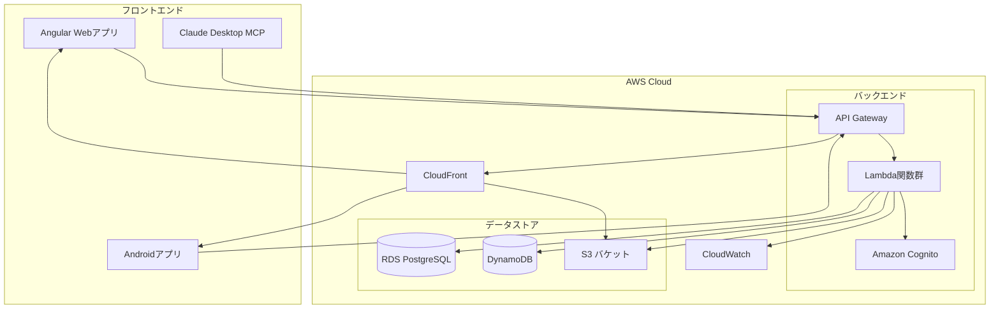
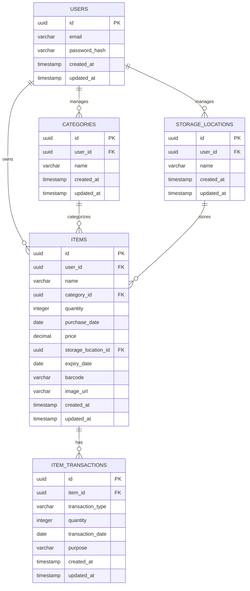

# 個人向け物品管理システム 基本設計

## 1. システムアーキテクチャ

### 全体構成

本システムは以下のコンポーネントで構成される：

1. **フロントエンド**
   - Angular Webアプリケーション
   - Androidアプリケーション
   - Claude Desktop用Model Context Protocol Server

2. **バックエンド**
   - AWS APIGateway + Lambda関数群
   - Amazon Cognito（認証）

3. **データストア**
   - Amazon RDS for PostgreSQL（主データベース）
   - Amazon DynamoDB（セッション管理）
   - Amazon S3（画像ストレージ）

### システムの特徴
- サーバーレスアーキテクチャによるコスト最小化
- API Gateway + Lambdaによる拡張性と柔軟性の確保
- クラウドネイティブなサービスの活用
- 状態管理はAngularのSignalを使用
- UIはモダンでシンプルなダークモード対応

## 2. データベース設計

### ER図

### 主要テーブル
#### users
| カラム名 | データ型 | 説明 |
|---------|---------|------|
| id | UUID | プライマリキー |
| email | VARCHAR(255) | ユーザーメールアドレス |
| password_hash | VARCHAR(255) | パスワード |
| created_at | TIMESTAMP | 作成日時 |
| updated_at | TIMESTAMP | 更新日時 |

#### items
| カラム名 | データ型 | 説明 |
|---------|---------|------|
| id | UUID | プライマリキー |
| user_id | UUID | ユーザーID (外部キー) |
| name | VARCHAR(255) | 物品名称 |
| category_id | UUID | カテゴリID (外部キー) |
| quantity | INTEGER | 数量 |
| purchase_date | DATE | 購入日 |
| price | DECIMAL | 価格 |
| storage_location_id | UUID | 保管場所ID (外部キー) |
| expiry_date | DATE | 消費期限 (NULL可) |
| barcode | VARCHAR(255) | バーコード情報 (NULL可) |
| image_url | VARCHAR(512) | 画像URL (NULL可) |
| created_at | TIMESTAMP | 作成日時 |
| updated_at | TIMESTAMP | 更新日時 |

#### categories
| カラム名 | データ型 | 説明 |
|---------|---------|------|
| id | UUID | プライマリキー |
| user_id | UUID | ユーザーID (外部キー) |
| name | VARCHAR(255) | カテゴリ名 |
| created_at | TIMESTAMP | 作成日時 |
| updated_at | TIMESTAMP | 更新日時 |

#### storage_locations
| カラム名 | データ型 | 説明 |
|---------|---------|------|
| id | UUID | プライマリキー |
| user_id | UUID | ユーザーID (外部キー) |
| name | VARCHAR(255) | 保管場所名 |
| created_at | TIMESTAMP | 作成日時 |
| updated_at | TIMESTAMP | 更新日時 |

#### item_transactions
| カラム名 | データ型 | 説明 |
|---------|---------|------|
| id | UUID | プライマリキー |
| item_id | UUID | 物品ID (外部キー) |
| transaction_type | VARCHAR(20) | トランザクション種別 ('in'/'out') |
| quantity | INTEGER | 数量 |
| transaction_date | DATE | 取引日 |
| purpose | VARCHAR(255) | 使用目的 (NULL可) |
| created_at | TIMESTAMP | 作成日時 |
| updated_at | TIMESTAMP | 更新日時 |

## 3. API設計

### 認証API
- POST /api/auth/signup - ユーザー登録
- POST /api/auth/login - ログイン
- POST /api/auth/refresh - トークンリフレッシュ
- POST /api/auth/password/reset - パスワードリセット

### 物品管理API
- GET /api/items - 物品一覧取得
- POST /api/items - 物品登録
- GET /api/items/:id - 物品詳細取得
- PUT /api/items/:id - 物品更新
- DELETE /api/items/:id - 物品削除

### 物品トランザクションAPI
- POST /api/items/:id/in - 入庫記録
- POST /api/items/:id/out - 出庫記録
- GET /api/items/:id/transactions - トランザクション履歴取得

### カテゴリAPI
- GET /api/categories - カテゴリ一覧取得
- POST /api/categories - カテゴリ登録
- PUT /api/categories/:id - カテゴリ更新
- DELETE /api/categories/:id - カテゴリ削除

### 保管場所API
- GET /api/storage-locations - 保管場所一覧取得
- POST /api/storage-locations - 保管場所登録
- PUT /api/storage-locations/:id - 保管場所更新
- DELETE /api/storage-locations/:id - 保管場所削除

### 分析API
- GET /api/analytics/inventory - 在庫状況分析
- GET /api/analytics/expiry - 消費期限分析

## 4. AWS構成

### 使用するAWSサービス
- **Amazon Cognito**: ユーザー認証
- **API Gateway**: RESTful API提供
- **AWS Lambda**: サーバーレス関数
- **Amazon RDS for PostgreSQL**: メインデータベース
- **Amazon DynamoDB**: セッション管理
- **Amazon S3**: 画像ストレージ
- **Amazon CloudFront**: コンテンツ配信
- **AWS CloudWatch**: モニタリング
- **AWS CDK**: インフラストラクチャのコード化

### デプロイ戦略
- CDKを用いたインフラのコード管理
- CI/CDによる自動デプロイ
- 環境分離（開発、テスト、本番）

## 5. フロントエンド設計

### 画面構成
1. **認証画面**
   - ログイン画面
   - パスワードリセット画面

2. **ダッシュボード**
   - 在庫概要
   - 注意アラート（在庫切れ、消費期限）

3. **在庫管理画面**
   - 一覧表示
   - 詳細表示
   - 登録/編集フォーム

4. **データ分析画面**
   - 在庫グラフ
   - 消費傾向

5. **設定画面**
   - カテゴリ管理
   - 保管場所管理
   - ユーザー設定

### 技術スタック
- **Webアプリケーション**: Angular, TypeScript, RxJS
- **Androidアプリケーション**: Kotlin, Jetpack Compose
- **Claude Desktop**: TypeScript, Model Context Protocol

## 6. セキュリティ設計

### 認証・認可
- JWT認証トークン
- Amazon Cognitoによるユーザー管理

### データ保護
- HTTPS通信
- データ暗号化（保存時）
- 適切なアクセス制御

## 7. 開発フェーズ

### フェーズ1（MVP - 1〜2ヶ月）
- 基本的なWeb UI実装
- 認証機能実装
- 基本的な物品CRUD操作
- AWS基本インフラ構築

### フェーズ2（2〜3ヶ月）
- 検索・フィルタリング機能実装
- 通知機能実装
- Androidアプリケーション開発
- データ分析機能の基本実装

### フェーズ3（2〜3ヶ月）
- バーコード・QRコードスキャン機能
- 画像管理機能
- Claude Desktop対応
- 高度なデータ分析